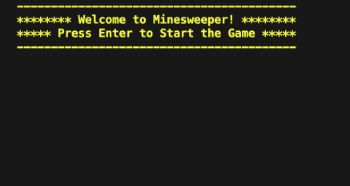
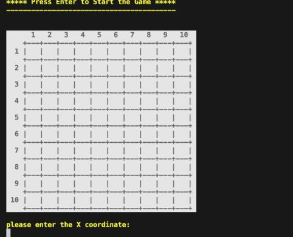
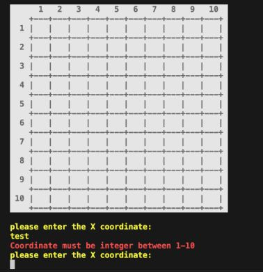
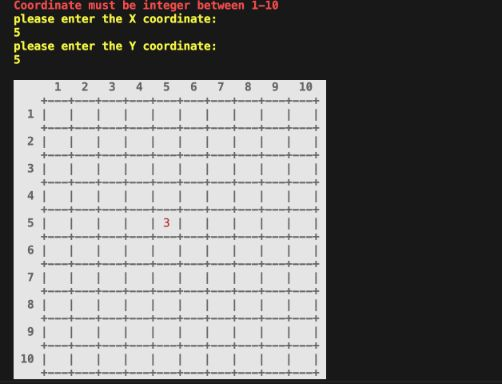
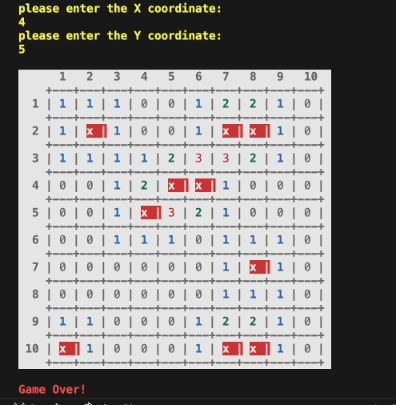
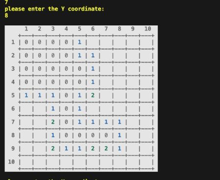
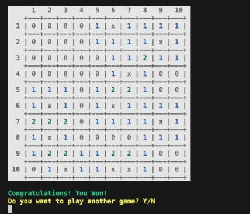
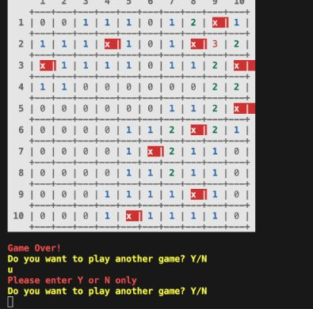

# Minesweeper

## Table of Contents
- [Overview](#overview)
- [Features](#features)
- [Contact](#contact)

## Overview

This is a simplified version of the game Minesweeper to be played in the java console. The game is able to randomly generate 10 mines in a 10x10 grid. The user is able to enter a command that represents a coordinate to check a location for a mine. The application will display a number from 0-8 depending on how many mines surround that location. If the user selects a mine, the game will be lost. If every non-mine square has been revealed, the game is won. Discovering an empty square will reveal all squares around it, and cascade into other nearby empty squares.

## Feature
This minesweeper game has the following features:
- There is a welcome banner when user first enter the game, and asked user to press enter to start the game:  

- After user enter the game, a 10x10 grid will be shown:  

And the user will be asked to enter the X and Y coordinate of the cell they want to choose

- The coordinate only allow integers between 1 and 10, so if the user entered an invalid coordinate, such as a string, a float or any integer not within the range, there will be hint of invalid enter in red colour and will ask the user to re-enter:  

- If the coordinates are valid, and if it is not a mine, that particular cell will be revealed with the number of mines surrounding it:  

And if it is a mine, that cell will be revealed with a X and all the other cells will also be revealed, with all the mines highlighted with red colour, the game then is over:  

- If the user chooses a cell which has no mine around it (has number 0 on it), all the 8 cells surrounding it will be revealed, and cascade into other nearby empty cells:  

- When all the non-mine cells have been revealed, the game is won and there will be a congratulation message shown:  

- After the game won or lost, the user will be asked if they want to play another game by enter Y or N, if they enter Y or y, there will be a new game shown; If they enter N or n, there will be a thanks for playing message shown; and if they enter anything else other than y or n, there will be a message hightlighted in red indicate that they can enter y or n only and re-asked if they want to play another game:  

## Contact
If you have additional questions, please contact me at:    
My github link: https://github.com/gulama2008   
My email address: siyu.liu.job@gmail.com
